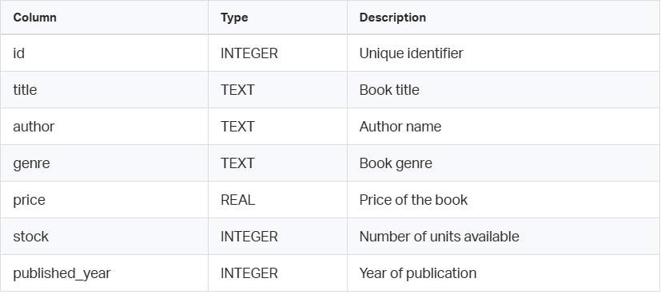
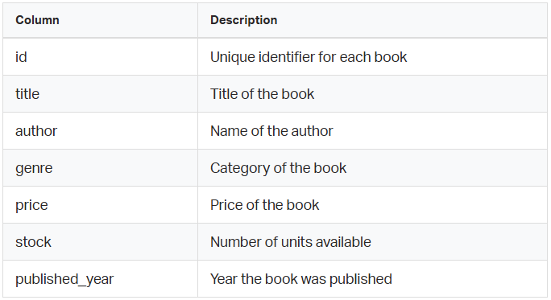
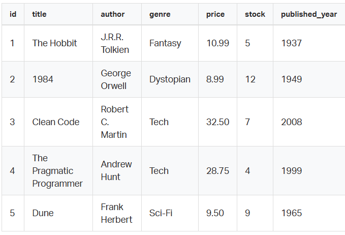

# SQL - CRUD Operations
  
---
  
Provided Files
  
You will be given a SQLite database file for some tasks found in ```books_dataset.db```

Table: ```books```

  
Note: SQLite uses flexible typing. Even though types are declared, they are not strictly enforced. This differs from most production databases.
  
General Requirements
- Environment used for correction:
- Ubuntu 20.04
- SQLite 3.x (CLI)
- Each task must be written in a .sql file
- Each task must use:
- one SQL query only, unless stated otherwise
- Queries must be executable using:
```
sqlite3 books.db < file.sql
```
Output must:
- match exactly the expected result
- include correct column order
- include correct row order when required
- if ordering is required, you must use:
```
ORDER BY
```
Do not:
- modify table structure unless explicitly instructed
- use joins or subqueries
- use non-standard SQL unless explicitly allowed
  
---
    
Introduction
  
In the relational model, a table is the fundamental structure used to store data.
  
Each table is defined by:
- a name
- a set of columns
- a type associated to each column
Before you can insert or query data, the database must know how the data is structured. This is done using the ```CREATE TABLE``` statement.
  
This task focuses on understanding:
- how a table is defined
- how columns are declared
- how basic constraints influence the structure of the data
  
Even though SQLite is flexible with types, you should aim to define a clear and consistent schema, as would be required in stricter database systems.
  
Context
  
You are working on a simple data system that stores information about books.

Your goal is to define a table named:
```
books
```
This table will be used in all subsequent tasks of the project.
  
Getting Started with SQLite
  
Before creating your table, you need to work inside a database.  
In this project, you will use SQLite, which stores the entire database in a single file.
  
Creating a new database
  
To create and open a new SQLite database, run:
```
sqlite3 my_database.db
```
If the file ```my_database.db``` does not exist, SQLite will create it automatically.
  
Once inside the SQLite prompt, you can execute SQL statements directly. Use ```.help``` to get info about the available SQLite commands.
  
Also you can run your ```.sql``` file from the shell using:
```
sqlite3 my_database.db < 0-create_table.sql
```
This will execute all the SQL statements contained in your file.
  
Important Notes
  
- For the first tasks in this project, you will use your own database (```my_database.db```), which you create and modify.
- In later tasks, you will use predefined database files provided to you. These contain existing data and must not be modified unless explicitly instructed.
  
About Other Database Systems
  
Different database systems (such as PostgreSQL, MySQL, or SQL Server) manage databases and schemas differently.
  
For example:
- Some systems require you to explicitly create a database before using it
- Others support multiple schemas within a single database
- Connection and initialization steps vary across systems
  
SQLite is used in this project because it is:
- simple to set up
- file-based (no server required)
- sufficient for learning core SQL concepts
  
However, the SQL queries you write in this project are designed to be as close as possible to standard SQL, so they can be adapted to other systems later.
  
Recommendation
  
Make sure you understand:
- where your database file is located
- how to execute your ```.sql``` files
- how to reset or recreate your database if needed
This will help you avoid issues in later tasks.
  
---
  
## 0. Understanding and Creating a Table
  
Create a SQL file:
```
0-create_table.sql
```
In this file, write a SQL query that creates a table named books with the following columns:

  
Requirements
- The table must be created using a single ```CREATE TABLE``` statement
- You must define appropriate SQL types for each column
- The column ```id``` must uniquely identify each row
- Some columns should not accept ```NULL``` values where it makes sense
- The schema must be logically consistent
  
Constraints
- You must not use any SQLite-specific shortcuts that would not exist in standard SQL unless strictly necessary
- You must not copy an example blindly — you are expected to:
- review documentation
- understand column types
- decide appropriate constraints
  
Expected Behavior
After executing your file:
```
sqlite3 my_database.db < 0-create_table.sql
```
The database must contain a table named ```books``` with the expected structure.
The checker will validate:
- that the table exists
- that all required columns exist
- that column names are correct
- that the primary key is correctly defined
- that non-null constraints are applied where expected
  
Guidance (Read Carefully)
- SQL types are not strictly enforced in SQLite, but you should still choose appropriate ones (e.g., ```TEXT```, ```INTEGER```, ```REAL```)
- Think carefully about:
- which fields must always have a value
- which field uniquely identifies a book
- Avoid overcomplicating the schema — keep it simple and correct
  
What You Are Learning
By completing this task, you will:
- understand how relational tables are defined
- learn how SQL describes data structure (not just data manipulation)
- begin thinking in terms of data modeling, even in a simple context
  
Common Mistakes to Avoid
- Forgetting to define a primary key
- Using inconsistent or inappropriate types
- Allowing all columns to be nullable without justification
- Writing multiple statements instead of a single ```CREATE TABLE```
  
Repo:

- GitHub repository: holbertonschool-data_modeling_and_persistence  
- Directory: sql_crud  
- File: 0-create_table.sql  
  
---

Introduction
  
Once a table has been created, it is empty.
  
To make it useful, you must insert data into it.
  
In SQL, this is done using the ```INSERT``` statement, which allows you to:
- add new rows
- specify values for each column
- optionally control which columns are populated
Understanding how to correctly insert data is essential, as it directly affects:
- data consistency
- future queries
- correctness of results
  
Context
  
In the previous task, you created a table named:
```
books
```
You will now populate this table with a predefined dataset.
  
This dataset will be used in all subsequent tasks, so it is critical that:
- all rows are inserted correctly
- values match exactly what is expected
  
## 1. Inserting Data into a Table
  
Create a SQL file:
```
1-insert_data.sql
```
In this file, write SQL queries to insert the following rows into the ```books``` table.
  
Dataset to insert
  
You must insert exactly these records:  

  
Requirements
- You must use ```INSERT INTO``` statements
- You must insert all rows into the existing books table
- Each row must contain values for all columns
- Values must match exactly the dataset provided
  
Constraints  
- You must not modify the table structure
- You must not delete or update rows in this task
- You must not use any non-standard SQL syntax
- You must not rely on SQLite-specific shortcuts (such as implicit column ordering assumptions without understanding them)
  
Expected Behavior
  
After executing:
```
sqlite3 my_database.db < 1-insert_data.sql
```
The table must contain exactly 5 rows with the specified values.
  
The checker will validate:
- total number of rows
- exact values of each row
- correct mapping between columns and values
  
Guidance (Read Carefully)
  
SQL allows inserting rows in multiple ways:
- one row per statement
- multiple rows in a single statement
  
You are free to choose the approach, but your result must be correct.
  
Be careful with:
- string values (must be quoted)
- numeric values (must not be quoted unnecessarily)
- column order
- A mismatch in column order will produce incorrect results even if the query executes successfully
  
What You Are Learning
  
By completing this task, you will:
- understand how rows are added to a table
- learn how SQL maps values to columns
- see how data persistence works in a database
  
Common Mistakes to Avoid
- Forgetting quotes around text values
- Mixing column order and value order
- Inserting fewer or more rows than required
- Introducing typos in values (this will break later tasks)
  
Repo:  
  
GitHub repository: holbertonschool-data_modeling_and_persistence  
Directory: sql_crud  
File: 1-insert_data.sql  
  
---
  
Introduction
  
Once data has been inserted into a table, the next step is to retrieve and inspect it.
  
In SQL, this is done using the ```SELECT``` statement.
  
The simplest form of ```SELECT``` allows you to:
- retrieve all rows
- retrieve all columns
- inspect the current state of the table
This is an essential debugging and validation step in real-world systems. Before modifying or analyzing data, you must be able to observe it correctly.
  
Context
  
At this point:
- The ```books``` table already exists
- It contains the dataset inserted in the previous task
Your goal is to retrieve all the data from this table exactly as it is stored.
  
## 2. Retrieving All Data from a Table
  
Create a SQL file:
```
2-select_all.sql
```
Write a SQL query that retrieves:
- all columns
- all rows
from the ```books``` table.
  
Requirements
- You must use a ```SELECT``` statement
- The query must return:
- every column in the table
- every row in the table
- The query must be written using standard SQL syntax
  
Constraints
  
You must not:
- filter rows
- sort results
- limit results
- modify the data
- You must not use multiple queries
- You must not assume any implicit ordering
  
Expected Behavior
  
After executing:
```
sqlite3 my_database.db < 2-select_all.sql
```
The output must contain exactly the 5 rows previously inserted.
  
⚠️ Important:
  
- The order of rows is not guaranteed
- The checker may enforce ordering — if so, it will be explicitly stated
  
Guidance (Read Carefully)
  
SQL provides a shorthand to select all columns, but you should understand:
- what it does
- when it is appropriate to use it
- Even though this task is simple, it introduces an important concept:
  
SQL queries describe what you want, not how to iterate
  
Think in terms of:
- sets of rows
- complete datasets
  
What You Are Learning
  
By completing this task, you will:
- understand how to retrieve data from a table
- verify that your previous inserts were successful
- build confidence using ```SELECT``` before adding complexity
  
Common Mistakes to Avoid
- Writing multiple queries instead of one
- Attempting to filter or sort (not required yet)
- Confusing table name or column names
- Assuming a specific output order without instructions
  
Repo:  
  
GitHub repository: holbertonschool-data_modeling_and_persistence  
Directory: sql_crud  
File: 2-select_all.sql  
  
---
  
Introduction
  
So far, you have retrieved entire rows from the table.
  
However, in real-world scenarios, you rarely need all the data at once. Instead, you usually want to retrieve only specific columns.
  
For example:
- only titles and authors
- only prices
- only identifiers
  
Selecting only the required columns:
- improves readability
- reduces unnecessary data processing
- is considered a best practice in SQL
  
This task introduces the idea that:
  
In SQL, you control not only which rows you retrieve, but also which columns you return.
  
Context
  
The ```books``` table already exists and contains data inserted in previous tasks.
  
You will now focus on retrieving partial information from this table.
  
## 3. Selecting Specific Columns
  
Create a SQL file:
```
3-select_columns.sql
```
Write a SQL query that returns:
- the ```title```
- the ```price```
for all books in the table.
  
Requirements
- You must use a ```SELECT``` statement
- You must return only the following columns:
- ```title```
- ```price```
- You must return all rows
- The order of columns in the result must be:
1. ```title```
2. ```price```
  
Constraints
  
You must not:
- use ```SELECT *```
- filter rows
- sort results
- limit results
- You must write a single SQL query
- You must use valid and standard SQL syntax
  
Expected Behavior
  
After executing:
```
sqlite3 my_database.db < 3-select_columns.sql
```
The output must contain:
- exactly 2 columns
- one row per book
- all values corresponding correctly to ```title``` and ```price```
  
Guidance (Read Carefully)
- SQL allows you to explicitly define which columns to return
- The order in which you write the columns in ```SELECT``` determines the output order
- This task introduces an important shift:
  
You are no longer thinking in terms of “rows”, but in terms of attributes of data
  
This is fundamental for:
- data analysis
- reporting
- API design
  
What You Are Learning
  
By completing this task, you will:
- understand how to retrieve only relevant data
- control the structure of query results
- improve clarity and precision in SQL queries
  
Common Mistakes to Avoid
- Using ```SELECT *``` instead of specifying columns
- Returning columns in the wrong order
- Including extra columns
- Misspelling column names
  
Repo:
  
GitHub repository: holbertonschool-data_modeling_and_persistence  
Directory: sql_crud  
File: 3-select_columns.sql  
  
---

Introduction
  
In previous tasks, you retrieved:
- all rows from a table
- specific columns
  
However, real-world queries rarely require all available data. Instead, you need to retrieve only the rows that match certain conditions.
  
This is done using the ```WHERE``` clause.
  
The ```WHERE``` clause allows you to:
- filter rows based on conditions
- combine multiple conditions
- precisely control the result set
  
Understanding how to filter data correctly is essential before moving to more advanced topics such as joins and aggregations.
  
Context
  
For this task, you will work with the preloaded dataset.
  
This database contains a larger version of the ```books table```, with more rows and more diverse data.
  
You must assume:
- the table already exists
- the data is already populated
- you must not modify the dataset
  
## 4. Filtering Rows
  
You must create the following SQL files.
  
Each file must contain one single SQL query.
  
4.1 Filter by exact value
  
Create:
```
4-filter_by_genre.sql
```
Write a query that returns:
- ```title```
- ```author```
for all books where:
- ```genre = 'Tech'```
  
4.2 Filter using comparison
  
Create:
```
4-filter_by_price.sql
```
Write a query that returns:
- ```title```
- ```price```
  
for all books where:
- ```price > 20```
  
4.3 Filter using AND
  
Create:
```
4-filter_with_and.sql
```
Write a query that returns:
- ```title```
- ```price```
  
for all books where:
- ```genre = 'Tech'```
- AND ```price > 30```
  
4.4 Filter using OR
  
Create:
```
4-filter_with_or.sql
```
Write a query that returns:
- ```title```
- ```genre```
  
for all books where:
- ```genre = 'Fantasy'```
- OR ```price < 10```
  
Requirements
  
For all files:
  
You must use:
- ```SELECT```
- ```WHERE```
- You must return exactly the requested columns
- You must use valid and standard SQL syntax
- Each file must contain only one query
  
Constraints
  
You must not:
- use ```SELECT *```
- modify the database
- use joins or subqueries
- You must not rely on implicit ordering
  
Expected Behavior
  
Each file will be executed independently:
```
sqlite3 books_dataset.db < file.sql
```
The checker will validate:
- the returned columns
- the correctness of the filtered rows
- the exact result set
  
Guidance (Read Carefully)
  
1. SQL evaluates conditions per row
  
Each row is tested against the condition in the ```WHERE``` clause.
  
Only rows where the condition evaluates to true are returned.
  
2. Logical operators
  
You will use:
- ```AND``` → both conditions must be true
- ```OR``` → at least one condition must be true
  
Understanding the difference is critical.
  
3. Think before writing the query
  
Do not guess the result.
  
Instead:
- read the condition carefully
- reason about which rows should match
- then write the query
  
What You Are Learning
  
By completing this task, you will:
- filter rows using conditions
- combine conditions using logical operators
- reason about result sets
- transition from simple retrieval to expressive queries
  
Common Mistakes to Avoid
- Using incorrect logical operators (```AND``` vs ```OR```)
- Returning extra columns
- Forgetting quotes around text values
- Writing multiple queries in one file
- Assuming a specific row order
  
Repo:  
  
GitHub repository: holbertonschool-data_modeling_and_persistence  
Directory: sql_crud  
File: 4-filter_by_genre.sql 4-filter_by_price.sql 4-filter_with_and.sql 4-filter_with_or.sql  
  
---
  
Introduction
  
So far, you have only read data from a database.
  
In this task, you will begin modifying existing data using the ```UPDATE``` statement.
  
```UPDATE``` is used when data already exists in a table, but one or more values must be changed.

This is a very common operation in real systems. For example:
- updating a product price
- correcting a publication year
- increasing available stock
- applying changes to a group of records
  
However, ```UPDATE``` must be used carefully.

If an ```UPDATE``` statement is written without an appropriate condition, it may modify more rows than intended.

For that reason, this task focuses on both:
- correct syntax
- correct targeting of rows

Context

For this task, you will work with the preloaded SQLite database.

This database already contains a populated ```books``` table.

Each solution file in this task will be executed and validated independently against the expected initial state.

You must assume:
- the schema already exists
- the table already contains data
- each file starts from a clean copy of the provided dataset
- you must not change the schema

## 5. Updating Rows

You must create the following SQL files.

Each file must contain one single SQL query.

5.1 Update one row using the primary key

Create:
```
5-update_by_id.sql
```
Write a query that updates the price of the book with:
- ```id = 3```

Setting the new value to:
- ```35.00```

5.2 Update multiple rows using a condition

Create:
```
5-update_by_condition.sql
```
Write a query that increases the ```stock``` by ```5``` for all books where:
- ```published_year < 2000```

5.3 Update multiple rows using a compound condition

Create:
```
5-update_with_and.sql
```
Write a query that decreases the ```price``` by ```10%``` for all books where:
- ```genre = 'Tech'```
- AND ```stock > 5```

Requirements

For all files:
- You must use an ```UPDATE``` statement
- You must use a ```SET``` clause
- You must use a ```WHERE``` clause
- Each file must contain exactly one SQL query

Additional requirements by file:
- ```5-update_by_id.sql``` must target the row using ```id```
- ```5-update_by_condition.sql``` must update all matching rows
- ```5-update_with_and.sql``` must use both conditions correctly

Constraints

You must not:
- modify the schema
- use ```ALTER TABLE```, ```DROP```, or any schema-changing statement
- use multiple queries in the same file
- use joins or subqueries
In ```5-update_by_id.sql```, you must use:
- ```id``` in the ```WHERE``` clause
- You must update only the column(s) requested in each file

Expected Behavior

Each file will be executed independently using:
```
sqlite3 books_dataset.db < file.sql
```
The checker will validate the resulting table state after each file is executed.

This means:
- each file must be correct on its own
- files do not depend on each other
- execution order between files does not matter

Guidance (Read Carefully)

1. ```UPDATE``` modifies existing rows

Unlike ```INSERT```, which adds new rows, ```UPDATE``` changes values already stored in the table.

2. The ```WHERE``` clause is critical

The ```WHERE``` clause determines which rows are modified.

Without ```WHERE```, the update would affect every row in the table.

3. The primary key is the safest way to target one row

When you need to update exactly one row, using the primary key is the safest and most precise approach.

In this table, the column:
```
id
```
uniquely identifies each row.

4. SQL works on sets of rows

In the second and third files, you are not targeting one row. You are targeting all rows that match a condition.

This is an important shift:

SQL does not think in terms of manual loops. It applies operations to all matching rows at once.

5. Expressions can be used in ```SET```

You are not limited to assigning fixed values.

For example, SQL also allows updates such as:
- increasing a numeric value
- decreasing a numeric value
- computing a new value based on the old one

You are expected to reason about how to express those changes correctly.

What You Are Learning

By completing this task, you will:
- modify existing rows using ```UPDATE```
- target one row safely using the primary key
- update multiple rows using conditions
- apply expressions inside ```SET```
- understand that SQL updates sets of rows, not one row at a time

Common Mistakes to Avoid
- Forgetting the ```WHERE``` clause
- Updating the wrong column
- Using a non-unique field when ```id``` is required
- Writing more than one query in a file
- Replacing a value when the task requires modifying it relative to its current value
- Misunderstanding ```AND``` and updating too many rows or too few rows
  
Repo:  
  
GitHub repository: holbertonschool-data_modeling_and_persistence  
Directory: sql_crud  
File: 5-update_by_id.sql 5-update_by_condition.sql 5-update_with_and.sql  
  
---
  
Introduction
  
So far, you have learned how to:
- insert new rows
- retrieve data
- filter rows
- update existing values

In this task, you will learn how to remove rows from a table using the ```DELETE``` statement.

```DELETE``` is used when certain data should no longer remain in the database.

Examples include:
- removing outdated records
- deleting invalid entries
- cleaning data based on a condition

Like ```UPDATE```, ```DELETE``` must be used carefully.

A ```DELETE``` statement without a correct ```WHERE``` clause may remove more rows than intended.

For this reason, this task focuses on both:
- correct SQL syntax
- correct row targeting

Context

For this task, you will work with the preloaded SQLite database.

This database already contains a populated ```books``` table.

Each solution file in this task will be executed and validated independently against the expected initial state.

You must assume:
- the schema already exists
- the table already contains data
- each file starts from a clean copy of the provided dataset
- you must not modify the schema

6. Deleting Rows

You must create the following SQL files.

Each file must contain one single SQL query.

6.1 Delete one row using the primary key

Create:
```
6-delete_by_id.sql
```
Write a query that deletes the row where:
- ```id = 8```

6.2 Delete multiple rows using a condition

Create:
```
6-delete_by_condition.sql
```
Write a query that deletes all rows where:
- ```stock = 0```

6.3 Delete multiple rows using a compound condition

Create:
```
6-delete_with_and.sql
```
Write a query that deletes all rows where:
- ```published_year < 1950```
- AND ```price < 9```

Requirements

For all files:
- You must use a ```DELETE``` statement
- You must use a ```WHERE``` clause
- Each file must contain exactly one SQL query

Additional requirements by file:
- ```6-delete_by_id.sql``` must target the row using ```id```
- ```6-delete_by_condition.sql``` must delete all matching rows
- ```6-delete_with_and.sql``` must use both conditions correctly

Constraints

You must not:
- modify the schema
- use ```ALTER TABLE```, ```DROP```, or any schema-changing statement
- use multiple queries in the same file
- use joins or subqueries

In ```6-delete_by_id.sql```, you must use:
- ```id``` in the ```WHERE``` clause
- You must delete only the rows requested in each file
  
Expected Behavior

Each file will be executed independently using:
```
sqlite3 books_dataset.db < file.sql
```
The checker will validate the resulting table state after each file is executed.

This means:
- each file must be correct on its own
- files do not depend on each other
- execution order between files does not matter

Guidance (Read Carefully)

1. ```DELETE``` removes rows from a table

Unlike ```UPDATE```, which changes values, ```DELETE``` removes entire rows.

Once the statement is executed, those rows are no longer part of the table.

2. The ```WHERE``` clause is critical

The ```WHERE``` clause determines which rows are removed.

Without ```WHERE```, the statement would delete every row in the table.

3. The primary key is the safest way to delete one row

When you need to remove exactly one row, using the primary key is the safest and most precise approach.

In this table, the column:
```
id
```
uniquely identifies each row.

4. SQL works on sets of rows

In the second and third files, you are deleting all rows that match a condition.

This reinforces an important idea:

SQL applies an operation to the full set of matching rows at once.

What You Are Learning

By completing this task, you will:
- remove rows using ```DELETE```
- target one row safely using the primary key
- delete multiple rows using conditions
- apply compound conditions when removing data
- understand the difference between updating rows and deleting rows

Common Mistakes to Avoid
- Forgetting the ```WHERE``` clause
- Using the wrong condition
- Deleting the wrong row
- Writing more than one query in a file
- Misunderstanding ```AND``` and deleting too many rows or too few rows
- Using a non-unique field when ```id``` is required

Repo:

GitHub repository: holbertonschool-data_modeling_and_persistence  
Directory: sql_crud  
File: 6-delete_by_id.sql 6-delete_by_condition.sql 6-delete_with_and.sql  

---


Introduction

So far, you have learned how to:
- retrieve data
- filter rows
- update and delete records

However, the results of a query are not always presented in a useful way.

By default:

SQL does not guarantee the order of returned rows.

In many cases, you need to:
- sort results (e.g., cheapest books first)
- retrieve only a subset (e.g., top 5 results)

This is done using:
- ```ORDER BY``` → to sort rows
- ```LIMIT``` → to restrict the number of rows returned

These are essential for:
- reporting
- dashboards
- APIs
- pagination

Context

For this task, you will work with the preloaded SQLite database.

This dataset contains a larger and more varied set of rows.

You must assume:
- the table already exists
- the data is already populated
- you must not modify the dataset

Each file will be executed independently.

7. Ordering and Limiting Results

You must create the following SQL files.

Each file must contain one single SQL query.

7.1 Order results ascending

Create:
```
7-order_by_price_asc.sql
```
Write a query that returns:
- ```title```
- ```price```
for all books, ordered by:
- ```price``` in ascending order

7.2 Order results descending

Create:
```
7-order_by_year_desc.sql
```
Write a query that returns:
- ```title```
- ```published_year```

for all books, ordered by:
- ```published_year``` in descending order

7.3 Limit results

Create:
```
7-limit_results.sql
```
Write a query that returns:
- ```title```
- ```price```

for the 3 cheapest books

7.4 Combine ORDER BY and LIMIT

Create:
```
7-order_and_limit.sql
```
Write a query that returns:
- ```title```
- ```stock```

for the 5 books with the highest stock

Requirements

For all files:
- You must use ```SELECT```
- You must return exactly the requested columns
- You must use ```ORDER BY``` when sorting is required
- You must use ```LIMIT``` when restricting results

Constraints

You must not:
- use ```SELECT *```
- modify the database
- use joins or subqueries
- Each file must contain exactly one SQL query
- Ordering must be explicit when required

Expected Behavior

Each file will be executed independently:
```
sqlite3 books_dataset.db < file.sql
```
The checker will validate:
- column selection
- ordering of rows
- correct number of rows returned
- correctness of values

Guidance (Read Carefully)

1. Ordering is not automatic

SQL does not guarantee row order unless you specify it.

If ordering matters, you must use:
```
ORDER BY column_name
```

2. Ascending vs descending
Ascending order:
```
  ORDER BY column ASC
```
(this is the default)

Descending order:
```
  ORDER BY column DESC
```

3. LIMIT restricts the number of rows
```LIMIT``` allows you to return only a subset of the result:

- ```LIMIT 3``` → returns at most 3 rows

4. ORDER BY + LIMIT must be combined correctly

When both are used:

SQL first orders the data, then applies the limit

This is critical for queries such as:
- “top 5”
- “cheapest 3”
- “latest 10”

What You Are Learning

By completing this task, you will:
- control how query results are ordered
- limit the size of result sets
- combine ordering and limiting
- produce meaningful query outputs

Common Mistakes to Avoid
- Forgetting ```ORDER BY``` when required
- Using the wrong sort direction
- Applying ```LIMIT``` without ordering when order matters
- Returning the wrong number of rows
- Returning incorrect columns

Repo:

GitHub repository: holbertonschool-data_modeling_and_persistence  
Directory: sql_crud  
File: 7-order_by_price_asc.sql 7-order_by_year_desc.sql 7-limit_results.sql 7-order_and_limit.sql  

---

Introduction

So far, you have worked with individual rows:
- selecting rows
- filtering rows
- updating and deleting rows
- ordering results

However, many real-world questions are not about individual records, but about summaries of data.

For example:
- How many books are there?
- What is the average price?
- What is the maximum stock available?
- What is the total value of all books?

To answer these questions, SQL provides aggregate functions.

Aggregate functions:
- operate on multiple rows
- return a single value
- summarize data

Context

For this task, you will work with the preloaded SQLite database:

You must assume:
- the table already exists
- the dataset is populated
- you must not modify the data

Each file will be executed independently.

## 8. Aggregate Functions

You must create the following SQL files.

Each file must contain one single SQL query.

8.1 Count total rows

Create:
```
8-count_books.sql
```
Write a query that returns:
- the total number of books in the table

8.2 Calculate average price

Create:
```
8-average_price.sql
```
Write a query that returns:
- the average value of the ```price``` column

8.3 Find maximum stock

Create:
```
8-max_stock.sql
```
Write a query that returns:
- the maximum value of the ```stock``` column

8.4 Calculate total stock

Create:
```
8-total_stock.sql
```
Write a query that returns:
- the total number of units available (sum of ```stock```)

8.5 Find minimum price

Create:
```
8-min_price.sql
```
Write a query that returns:
- the minimum value of the ```price``` column

Requirements

For all files:
- You must use ```SELECT```
- You must use the appropriate aggregate function
- Each file must contain exactly one SQL query
- Each query must return a single value

Constraints

You must not:
- use ```SELECT *```
- modify the database
- use joins or subqueries
- You must not return multiple columns unless required
- Each query must produce a deterministic result

Expected Behavior

Each file will be executed independently:
```
bash id="t8run" sqlite3 books_dataset.db < file.sql
```
The checker will validate:
- that the correct aggregate function is used
- that the returned value is correct
- that only the expected result is returned

Guidance (Read Carefully)

1. Aggregate functions operate on columns

Unlike previous queries, aggregate functions do not return rows — they return a single summarized value.

2. Common aggregate functions

You will use:

- ```COUNT()``` → number of rows
- ```AVG()``` → average value
- ```MAX()``` → maximum value
- ```MIN()``` → minimum value
- ```SUM()``` → total value

3. Result shape changes

A normal ```SELECT``` returns multiple rows.

An aggregate query returns:

one row, one value (in this task)

4. Be precise with columns

Each aggregate function must be applied to the correct column.

For example:
- counting rows is different from summing stock
- averaging price is different from finding minimum price

What You Are Learning

By completing this task, you will:
- summarize datasets using aggregate functions
- understand how SQL transforms multiple rows into a single result
- move from row-level thinking to dataset-level reasoning

Common Mistakes to Avoid
- Using the wrong aggregate function
- Applying the function to the wrong column
- Returning extra columns
- Writing multiple queries in a file
- Confusing ```COUNT(*)``` with counting specific columns

Repo:

GitHub repository: holbertonschool-data_modeling_and_persistence  
Directory: sql_crud  
File: 8-count_books.sql 8-average_price.sql 8-max_stock.sql 8-total_stock.sql 8-min_price.sql  

--- 

Introduction

In the previous task, you used aggregate functions such as:
- ```COUNT```
- ```AVG```
- ```SUM```
- ```MIN```
- ```MAX```

Those functions summarized the entire table.

But many real-world questions require summaries per category, not for the whole dataset.

For example:
- total number of books per genre
- average price per genre
- total stock per author

This is done by combining:
- aggregate functions
- ```GROUP BY```

```GROUP BY``` tells SQL to:
- split the rows into groups
- apply the aggregate function to each group separately

Context

For this task, you will work with the preloaded SQLite database:

You must assume:
- the table already exists
- the dataset is already populated
- you must not modify the data

Each file will be executed independently.

## 9. Grouping Data with ```GROUP BY```

You must create the following SQL files.

Each file must contain one single SQL query.

9.1 Count books by genre

Create:
```
9-count_by_genre.sql
```
Write a query that returns:
- ```genre```
- the number of books in that genre

for all genres in the table.

9.2 Average price by genre

Create:
```
9-average_price_by_genre.sql
```
Write a query that returns:
- ```genre```
- the average price of books in that genre

for all genres in the table.

9.3 Total stock by genre

Create:
```
9-total_stock_by_genre.sql
```
Write a query that returns:
- ```genre```
- the total stock for that genre

for all genres in the table.

9.4 Count books by author

Create:
```
9-count_by_author.sql
```
Write a query that returns:
- ```author```
- the number of books written by that author

for all authors in the table.

Requirements

For all files:
- You must use ```SELECT```
- You must use an aggregate function
- You must use ```GROUP BY```
- You must return exactly the requested columns
- Each file must contain exactly one SQL query

Constraints

You must not:
- use ```SELECT *```
- modify the database
- use joins or subqueries
- You must not return columns that are not requested
- If a query includes both grouped and aggregated values, they must be logically consistent

Expected Behavior

Each file will be executed independently:
```
sqlite3 books_dataset.db < file.sql
```
The checker will validate:
- the grouped column
- the aggregated value
- the correctness of the result set
- the exact number of rows returned

Guidance (Read Carefully)

1. ```GROUP BY``` creates groups of rows

Instead of treating the whole table as one set, SQL will split it into smaller sets based on the grouped column.

For example:

- all ```Fantasy``` books together
- all ```Tech``` books together
- all ```Sci-Fi``` books together

2. Aggregate functions are applied per group

After rows are grouped, the aggregate function is calculated separately for each group.

That is why one query can return multiple rows, each representing a category.

3. Be careful about selected columns

When using ```GROUP BY```, the columns in the ```SELECT``` clause must make sense.

In this task, each result row should include:
- the grouping column
- one aggregated value

4. Result ordering

The order of grouped results is not guaranteed unless you explicitly sort them.

If ordering is required in a later task, it will be stated explicitly.

For this task, do not assume any implicit order.

What You Are Learning

By completing this task, you will:
- group rows by a category
- apply aggregate functions per group
- understand the difference between whole-table summaries and grouped summaries
- write analytical SQL queries

Common Mistakes to Avoid
- Forgetting ```GROUP BY```
- Grouping by the wrong column
- Using the wrong aggregate function
- Returning extra columns
- Confusing grouped output with simple row selection

Repo:

GitHub repository: holbertonschool-data_modeling_and_persistence  
Directory: sql_crud  
File: 9-count_by_genre.sql 9-average_price_by_genre.sql   9-total_stock_by_genre.sql 9-count_by_author.sql  

---

Introduction

In previous tasks, you learned SQL concepts step by step:
- retrieving data
- filtering rows
- updating and deleting records
- ordering results
- summarizing data
- grouping data

In real-world scenarios, SQL is not used through isolated exercises. Instead, you are given requirements, and you must determine:
- what data is needed
- which rows are relevant
- which SQL operations to apply

This task simulates that situation.

You will be given a series of user requirements, and you must translate them into correct SQL queries.

Context

You are working with the preloaded SQLite database:

You must assume:
- the ```books``` table already exists
- the dataset is already populated
- each solution file is evaluated independently
- you must not modify the schema

Each file must contain one single SQL query.

Important Note

Different SQL queries can produce the same correct result.

Your solution will be evaluated based on the correctness of the output, not the exact query used.

## 10. Integrative Queries and Data Manipulation

You must create the following SQL files.

10.1 Retrieve available technical books

Create:
```
10-select_tech_books.sql
```
A user wants to see:

all technical books that were published in or after the year 2000

Return:
- ```title```
- ```price```
- ```stock```

10.2 Increase stock for low-availability books

Create:
```
10-increase_stock.sql
```
A user wants to restock books that are running low.

Update the dataset so that:

all books with fewer than 5 units available receive 3 additional units in stock

10.3 Remove unavailable books

Create:
```
10-delete_zero_stock.sql
```
A user wants to clean the dataset by removing:

all books that are no longer available (no units in stock)

10.4 Find the cheapest available books

Create:
```
10-cheapest_available.sql
```
A user wants to see:

the 4 cheapest books that are currently available in stock

Return:
- ```title```
- ```price```

The result must be ordered so that the cheapest books appear first.

10.5 Total stock per genre

Create:
```
10-stock_by_genre.sql
```
A user wants to understand inventory distribution.

Return:
- each genre
- the total number of units available for that genre

10.6 Average price per genre

Create:
```
10-average_price_by_genre.sql
```
A user wants to compare pricing across categories.

Return:
- each genre
- the average price of books in that genre

Requirements

For all files:
- Each file must contain exactly one SQL query
- You must choose the correct SQL statement based on the requirement:
- ```SELECT```, ```UPDATE```, or ```DELETE```
- You must return exactly the requested columns when applicable
- Queries must produce correct and deterministic results

Constraints

You must not:
- modify the schema
- use ```ALTER TABLE```, ```DROP```, or any schema-changing statement
- use joins or subqueries
- write multiple queries in the same file

You must:
- use ```WHERE``` when row targeting is required
- use ```ORDER BY``` and ```LIMIT``` when needed
- use aggregate functions and ```GROUP BY``` when required

Expected Behavior

Each file will be executed independently:
```
sqlite3 books_dataset.db < file.sql
```
The checker will validate:
- correctness of the result set (for ```SELECT```)
- correctness of the final table state (for ```UPDATE``` and ```DELETE```)
- correct grouping and aggregation where applicable

Guidance (Read Carefully)

1. Translate requirements into conditions

You must interpret phrases such as:
- “available in stock”
- “fewer than 5 units”
- “published in or after the year 2000”

and convert them into precise SQL conditions.

2. Be precise

Even though multiple solutions are possible, the result must be:
- logically correct
- consistent with the requirement

3. Think before writing

Do not rely on trial and error.

Instead:
- identify the relevant rows
- determine the required operation
- define the correct output

4. Use the right tool
Each requirement maps to a different type of SQL operation:
- retrieving data → ```SELECT```
- modifying values → ```UPDATE```
- removing rows → ```DELETE```
- summarizing → aggregate functions

What You Are Learning

By completing this task, you will:
- translate real-world requirements into SQL queries
- apply multiple SQL concepts correctly
- reason about data instead of following patterns
- prepare for more advanced SQL topics

Common Mistakes to Avoid
- Misinterpreting the requirement
- Using the wrong SQL statement
- Forgetting conditions in ```UPDATE``` or ```DELETE```
- Returning incorrect columns
- Forgetting ordering or limiting when required
- Writing queries that produce incomplete or incorrect results

Final Note

This task represents a shift:

from executing instructions → to understanding requirements

This is the level of reasoning expected in the next stages of your learning.

Repo:

GitHub repository: holbertonschool-data_modeling_and_persistence  
Directory: sql_crud  
File: 10-select_tech_books.sql 10-increase_stock.sql 10-delete_zero_stock.sql 10-cheapest_available.sql 10-stock_by_genre.sql 10-average_price_by_genre.sql  
