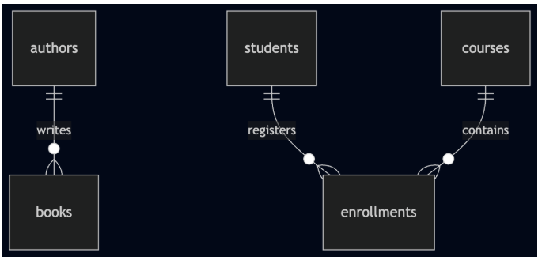
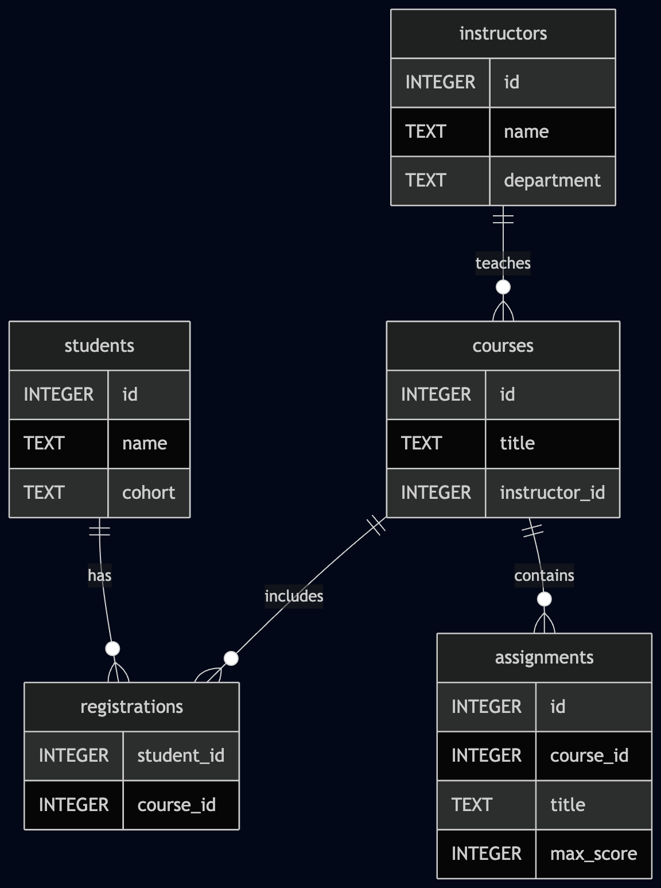

# SQL - Joins & Relationships

---

Provided Files

You will be using the following dataset found in library.db

Tables:

authors
- id
- name
- country

books
- id
- title
- author_id
- price

students
- id
- name

courses
- id
- title

enrollments
- student_id
- course_id

General Requirements

Environment:
- Ubuntu 20.04
- SQLite 3.x

Each task:
- must be a ```.sql``` file
- must contain a single query (unless stated otherwise)

Execution:
```
sqlite3 library.db < file.sql
```

Output must:
- match expected results exactly
- include explicit ```ORDER BY``` when needed

Do not:
- modify schema unless instructed
- use unsupported SQL features

Important Notes

1. Join conditions are critical

A missing or incorrect ```ON``` condition can produce incorrect results.

2. NULL values

In outer joins:
- missing matches → ```NULL```
- you must interpret them correctly

3. Relationships vs Queries
- Relationships define structure
- Joins reconstruct that structure in queries

4. SQLite behavior
- Foreign keys may not be enforced unless enabled
- Some SQL features differ from other databases

Always focus on writing logically correct SQL, not relying on engine-specific behavior.

SQLite does not support:
- RIGHT JOIN
- FULL OUTER JOIN

These can be simulated, but are not required in this project.

Final Remarks

This project introduces a key shift:

You are now working with connected data, not isolated tables.

Take time to understand:
- how tables relate to each other
- how joins reconstruct relationships
- how queries reflect data structure

This understanding is essential before moving into database design and normalization.

---

## 0. Understanding Table Relationships

Introduction

Before writing queries that combine multiple tables, you need to understand how those tables are connected.

In relational databases, tables are not independent. They are linked through keys, which define how data relates across the system.

This section introduces the structure of the dataset you will use throughout the project.

Visualizing the Database

The following diagram represents the relationships between the tables in ```library.db```.

```
erDiagram
    authors ||--o{ books : writes
    students ||--o{ enrollments : registers
    courses ||--o{ enrollments : contains
```

How to Read This Diagram
- ```||``` means “one”
- ```o{``` means “many”

So:
- One author can write many books → (1–N)
- One student can have many enrollments
- One course can have many enrollments
- The ```enrollments``` table connects students and courses → (N–N)

Key Concepts

Primary Key

A column that uniquely identifies a row in a table.

Foreign Key

A column that references a primary key in another table.

Examples:
- ```books.author_id``` → ```authors.id```
- ```enrollments.student_id``` → ```students.id```
- ```enrollments.course_id``` → ```courses.id```

Why This Matters

You will use this structure to:
- write JOIN queries
- combine data from multiple tables
- answer more complex questions

If you do not understand how tables relate, your queries will be incorrect.

---

Introduction

In this task, you will write your first query that combines data from multiple tables.

So far, you have worked with single tables. Now, you will use a JOIN to connect related data.

Objective

Retrieve a list of books along with the name of their corresponding author.

Relevant Tables

You will work with:

books
- ```id```
- ```title```
- ```author_id```
- ```price```

authors
- ```id```
- ```name```
- ```country```

Relationship Reminder
- Each book has an ```author_id```
- This refers to ```authors.id```

This is a one-to-many (1–N) relationship:
- one author → many books

## 1. Retrieve Books with Their Authors

Write a SQL query that returns:
- the book title
- the author name

Expected Output

Your result must contain exactly two columns, in this order:
```
title | author_name
```
Each row represents one book and its corresponding author.

Requirements

You must use:
- ```INNER JOIN```

You must explicitly define the join condition using:
- ```ON```

Column names must match exactly:
- ```title```
- ```author_name``` (use alias if needed)

Results must be in ascending ordered by ```title```.

Output Example (format only)
```
Alice in Wonderland | Lewis Carroll
1984 | George Orwell
```
Common Mistakes to Avoid

- Missing ```ON``` condition → produces incorrect results
- Using ```SELECT *``` → returns too many columns
- Forgetting ```ORDER BY``` → results may not match expected output
- Incorrect column names → will fail validation

What This Task Teaches You
- How to combine two tables using a join
- How relationships are used in queries
- How to control output structure (columns and order)

This is the foundation for all multi-table queries.

Repo:

GitHub repository: holbertonschool-data_modeling_and_persistence  
Directory: sql_join  
File: 1-books-with-authors.sql  

---

Introduction

In the previous task, you used an INNER JOIN, which only returns rows where a match exists in both tables.

However, in real-world data, not all relationships are complete.
- Some authors may not have any books
- Some relationships may be optional

To handle these cases, SQL provides OUTER JOINs.

Objective

Retrieve a list of all authors, including those who do not have any books, along with their book titles when available.

Relevant Tables

authors
```id```
```name```
```country```

books
```id```
```title```
```author_id```

Key Concept

A LEFT JOIN:

Returns all rows from the left table, and matching rows from the right table. If no match exists, the result will contain ```NULL``` values.

## 2. List All Authors and Their Books

Write a SQL query that returns:
- the author name
- the book title (if any)

Expected Output

Your result must contain exactly two columns, in this order:
```
author_name | title
```
- Each row represents:
- an author and one of their books
- or an author with ```NULL``` if they have no books

Requirements

You must use:
- ```LEFT JOIN```

You must explicitly define the join condition using:
- ```ON```

Column names must match exactly:
- ```author_name```
- ```title```

Results must be in ascending order by ```author_name``` and ```title```.

Note: ```NULL``` values will appear first when ordering ascending.

Output Example (format only)
```
Agatha Christie | Murder on the Orient Express
Agatha Christie | Death on the Nile
George Orwell | 1984
Unknown Author | NULL
```
Common Mistakes to Avoid
- Using ```INNER JOIN``` instead of ```LEFT JOIN```
- Starting from the wrong table (```books```)
- Filtering out ```NULL``` values unintentionally
- Forgetting ```ORDER BY```
- Returning extra columns

What This Task Teaches You
- The difference between INNER JOIN and LEFT JOIN
- How to handle missing relationships
- How ```NULL``` values appear in results
- Why the starting table matters in a join

Repo:

GitHub repository: holbertonschool-data_modeling_and_persistence  
Directory: sql_join  
File: 2-authors-with-books.sql  

--- 

Introduction

Some relationships cannot be represented with a single foreign key.

For example:
- one student can enroll in many courses
- one course can include many students
  
This is a many-to-many (N–N) relationship.

To represent it, relational databases use a junction table.

In this project, that table is:
```
enrollments
```
This task introduces queries that combine three tables.

Objective

Retrieve a list of students and the courses they are enrolled in.

Relevant Tables

students
- ```id```
- ```name```

courses
- ```id```
- ```title```

enrollments
- ```student_id```
- ```course_id```

Relationship Reminder
- ```enrollments.student_id``` refers to ```students.id```
- ```enrollments.course_id``` refers to ```courses.id```

This means:
- one student → many enrollments
- one course → many enrollments
- together, ```enrollments``` connects students and courses

## 3. List Students and Their Courses

Write a SQL query that returns:
- the student name
- the course title

Each row must represent one enrollment.

Expected Output

Your result must contain exactly two columns, in this order:
```
student_name | course_title
```

Requirements

You must use:
- ```INNER JOIN```

You must join three tables

You must explicitly define join conditions using:
- ```ON```

Column names must match exactly:
- ```student_name```
- ```course_title```

Results must be in ascending ordered by ```student_name```, then ```course_title```.

Output Example (format only)
```
Alice Johnson | Databases
Alice Johnson | Web Development
Brian Smith | Algorithms
Carla Gomez | Databases
```

Common Mistakes to Avoid
- Joining ```students``` directly to ```courses```
- Forgetting that ```enrollments``` is required
- Returning IDs instead of names/titles
- Using incorrect aliases or column names
- Forgetting ```ORDER BY```

What This Task Teaches You
- How many-to-many relationships are represented
- Why junction tables are necessary
- How to join more than two tables
- How one real-world relationship may require multiple joins

Repo:

GitHub repository: holbertonschool-data_modeling_and_persistence  
Directory: sql_join  
File: 3-students-and-courses.sql  

---

Introduction

In the previous task, you listed students and the courses they are enrolled in.

Now you will write a query from the other side of the relationship:
- every course should appear
- courses without students must still be included

This requires using a LEFT JOIN with the junction table and understanding how ```NULL``` appears when no related rows exist.

Objective

Retrieve a list of all courses and the students enrolled in each one.

If a course has no students, it must still appear in the result.

Relevant Tables

courses
- ```id```
- ```title```

enrollments
- ```course_id```
- ```student_id```

students
- ```id```
- ```name```

Relationship Reminder

- ```enrollments.course_id``` refers to ```courses.id```
- ```enrollments.student_id``` refers to ```students.id```

A course can have:
- many enrollments
- or no enrollments at all

## 4. List All Courses and Their Students

Write a SQL query that returns:
- the course title
- the student name, if one exists

Each row must represent:
- one course-student enrollment
- or one course with ```NULL``` if no students are enrolled

Expected Output

Your result must contain exactly two columns, in this order:
```
course_title | student_name
```

Requirements

You must use:
- ```LEFT JOIN```

You must join three tables

You must explicitly define join conditions using:
- ```ON```

Column names must match exactly:
- ```course_title```
- ```student_name```

Results must be in ascending ordered by ```course_title```, then ```student_name```.

Note: if a course has no students, ```student_name``` will be ```NULL```.

Output Example (format only)
```
Algorithms | Brian Smith
Databases | Alice Johnson
Databases | Carla Gomez
Operating Systems | NULL
Web Development | Alice Johnson
```

Common Mistakes to Avoid
- Using ```INNER JOIN``` instead of ```LEFT JOIN```
- Starting from ```enrollments``` instead of ```courses```
- Expecting a course with students to also appear once with ```NULL```
- Returning IDs instead of course titles and student names
- Forgetting ```ORDER BY```

Important Clarification

If a course has:
- two students, it appears in two rows
- no students, it appears in one row with ```NULL```

Example:
```
Databases | Alice Johnson
Databases | Carla Gomez
Operating Systems | NULL
```

What This Task Teaches You
- How to use ```LEFT JOIN``` in a many-to-many context
- How the starting table affects the result
- How to preserve rows that have no match
- How to interpret ```NULL``` values correctly

Repo:

GitHub repository: holbertonschool-data_modeling_and_persistence  
Directory: sql_join  
File: 4-courses-and-students.sql  

---

Introduction

So far, you have used JOINs to combine data from multiple tables.

In this task, you will solve a similar problem using a different approach: a subquery.

A subquery allows you to:
- compute a set of values
- use that result to filter another query

Objective

Retrieve a list of students who are enrolled in at least one course.

Relevant Tables

students
- ```id```
- ```name```

enrollments
- ```student_id```
- ```course_id```

Key Concept

A subquery can be used inside a ```WHERE``` clause to filter results.

Example pattern:
```
SELECT ...
FROM table
WHERE column IN (
    SELECT column
    FROM another_table
);
```

## 5. Find Students Enrolled in At Least One Course

Write a SQL query that returns:
- the student name

Only include students who appear in the ```enrollments``` table.

Expected Output

Your result must contain exactly one column:
```
student_name
```

Each row must represent a student who is enrolled in at least one course.

Requirements
- You must use:
- a subquery

You must use:
- ```IN```

Column name must match exactly:
- ```student_name```

Results must be in ascending ordered by ```student_name```.

Output Example (format only)
```
Alice Johnson
Brian Smith
Carla Gomez
```

Common Mistakes to Avoid
- Using a JOIN instead of a subquery
- Returning IDs instead of student names
- Forgetting ```ORDER BY```
- Not using ```IN```
- Writing a subquery that returns the wrong column

What This Task Teaches You
- How to use a subquery in a WHERE clause
- How to filter based on a set of values
- How subqueries can replace some JOIN use cases

Important Note

This query could also be solved using a ```JOIN```.

However, the goal of this task is to understand how subqueries work, not to compare approaches yet.

Repo:

GitHub repository: holbertonschool-data_modeling_and_persistence  
Directory: sql_join  
File: 5-students-with-enrollments.sql  

---

Introduction

In the previous task, you used a subquery to filter rows based on a set of values.

In this task, you will extend that idea by using a subquery with aggregation.

You will:
- count how many students are enrolled in each course
- compute the average number of enrollments
- compare each course against that average

Objective

Retrieve the list of courses that have more enrollments than the average number of enrollments per course.

Relevant Tables

courses
- ```id```
- ```title```

enrollments
- ```course_id```
- ```student_id```

Key Concepts

You will use:
- ```COUNT()``` to measure enrollments per course
- ```GROUP BY``` to aggregate per course
- a subquery to compute the average

## 6. Find Courses with Above-Average Enrollment

Write a SQL query that returns:
- the course title

Only include courses where the number of enrollments is greater than the average across all courses.

Expected Output

Your result must contain exactly one column:
```
course_title
```

Requirements

You must use:
- ```GROUP BY```
- ```COUNT()```
- a subquery

You must compare against:
- an aggregated value (average)

Column name must match exactly:
- ```course_title```

Results must be in ascending ordered by ```course_title```.

Output Example (format only)
```
Databases
Web Development
```

Common Mistakes to Avoid
- Forgetting ```GROUP BY```
- Comparing against the wrong value (e.g., average of all rows instead of - grouped counts)
- Returning course IDs instead of titles
- Missing the subquery
- Incorrect aggregation logic

Important Clarification

The average must be computed over:

the number of enrollments per course

Not:
- total enrollments
- number of courses
- or raw rows

What This Task Teaches You

How to combine:
- aggregation
- grouping
- subqueries

How to compare grouped results against a computed value

How to reason about multi-step queries

Repo:

GitHub repository: holbertonschool-data_modeling_and_persistence  
Directory: sql_join  
File: 6-courses-above-average.sql  

--- 

Introduction

In the previous task, you used aggregation and a subquery to filter courses based on their number of enrollments.

In this task, you will focus on computing and presenting aggregated data, without filtering.

This is a common real-world requirement:

not just filtering data, but summarizing it clearly.

Objective

Retrieve a list of all courses along with the number of students enrolled in each course.

Courses with no students must also appear.

Relevant Tables

courses
- ```id```
- ```title```

enrollments
- ```course_id```
- ```student_id```

Key Concept

You must:
- count how many enrollments each course has
- include courses with zero enrollments

This requires combining:
- ```LEFT JOIN```
- ```GROUP BY```
- ```COUNT()```

## 7. Retrieve Courses and Their Enrollment Count

Write a SQL query that returns:
- the course title
- the number of enrolled students

Expected Output

Your result must contain exactly two columns, in this order:
```
course_title | enrollment_count
```
Requirements

You must use:
- ```LEFT JOIN```
- ```GROUP BY```
- ```COUNT()```

Column names must match exactly:
- ```course_title```
- ```enrollment_count```

Results must be in descending order of ```enrollment_count```, then ascending order of ```course_title```.

Output Example (format only)
```
Databases | 2
Web Development | 1
Operating Systems | 0
```
Common Mistakes to Avoid
- Using ```INNER JOIN``` (this will exclude courses with no students)
- Using ```COUNT(*)``` (this may produce incorrect counts with LEFT JOIN)
- Forgetting ```GROUP BY```
- Returning course IDs instead of titles
- Incorrect ordering

Important Clarification

Courses with no enrollments must appear with a count of ```0```

This only works correctly if:
- you use ```LEFT JOIN```

and count a column from the joined table

What This Task Teaches You

How to summarize data using aggregation

How to correctly handle missing relationships in grouped queries

The difference between:
- ```COUNT(*)```
- ```COUNT(column)```

How to combine joins and aggregation safely

Repo:

GitHub repository: holbertonschool-data_modeling_and_persistence  
Directory: sql_join  
File: 7-course-enrollment-count.sql  

---

Introduction

In this practice block, you will work with a new dataset and apply the concepts from this project in a more deliberate way.

This block does not introduce new concepts.

Instead, it gives you a more complete dataset and asks you to solve a set of realistic query scenarios using the SQL knowledge you have already built in this project.

You will need to:
- read the schema carefully
- infer how the tables are related
- choose an appropriate query strategy
- return the exact data requested in each scenario

This is a practice block before the final quiz.

Objective

Use the provided dataset to answer a set of data requests based on:
- relationships between tables
- one-to-many and many-to-many structures
- optional relationships
- grouped results
- filtering based on related data
- filtering based on computed results

Provided Files

For this task you'll be using the SQLite database found in academy.db

Database Schema

Use the following diagram to understand the dataset structure.

You are expected to use it to infer how tables are connected.



General Requirements

Environment used for correction:

- Ubuntu 20.04
- SQLite 3.x

Each scenario must be solved in its own ```.sql``` file

Each file must contain:
- exactly one SQL query

Queries must be executable using:
```
sqlite3 academy.db < file.sql
```
Your results must:
- match the requested data exactly
- use the correct output columns
- be deterministic

If a result must appear in a specific sequence, that requirement is described in the scenario and must be respected

Multiple valid SQL solutions are allowed

Do not:
- modify the database
- insert, update, or delete data
- change the schema

## 8. Integrating Joins, Relationships, and Subqueries

You have been asked to support a small academic platform by answering the following data requests.

Each request must be solved in the indicated file.

Scenario 1

The academic team wants a list of all courses together with the name of the instructor responsible for each one.

The result must show:
- the course title
- the instructor name

The list must be presented in alphabetical order by course title.

Provide your query in:
```
8-courses-and-instructors.sql
```

Scenario 2

The platform administrators want to review all instructors, including those who are not currently assigned to any course.

For each instructor, they want to see:
- the instructor name
- the course title, when one exists

If an instructor is not assigned to any course, that instructor must still appear in the result.

The list must be presented in alphabetical order by instructor name. When an instructor appears in more than one row, their courses must also appear in alphabetical order.

Provide your query in:
```
9-instructors-and-courses.sql
```

Scenario 3

Student support needs a list showing which courses each student is registered in.

The result must show:
- the student name
- the course title

Each row must represent one registration.

The list must be presented in alphabetical order by student name, and then by course title.

Provide your query in:
```
10-students-and-registered-courses.sql
```

Scenario 4

The academic team wants to know how many students are registered in each course.

They want the result to include every course, even if no students are currently registered in it.

The result must show:
- the course title
- the number of registrations

Courses with more registrations must appear first. If two courses have the same number of registrations, they must be ordered alphabetically by course title.

Provide your query in:
```
11-course-registration-count.sql
```

Scenario 5
Student services wants a list of students who are actively registered in at least one course.

The result must show:
- the student name
Each student must appear only once.

The list must be presented in alphabetical order by student name.

Provide your query in:
```
12-students-with-registrations.sql
```

Scenario 6

The curriculum team wants to identify courses that have a heavier-than-average assignment load.

They define this as:
- courses whose number of assignments is greater than the average number of assignments per course in the dataset

The result must show:
- the course title

The list must be presented in alphabetical order by course title.

Provide your query in:
```
13-courses-above-average-assignments.sql
```

Scenario 7

The teaching team wants to review all courses and the assignments associated with them.

They want the result to include every course, even if a course does not yet have any assignments.

The result must show:
- the course title
- the assignment title, when one exists

If a course has no assignments, it must still appear in the result.

The list must be presented in alphabetical order by course title. When a course appears in more than one row, its assignment titles must also appear in alphabetical order.

Provide your query in:
```
14-courses-and-assignments.sql

Scenario 8

The academic director wants a list of instructors who are currently teaching at least one course with at least one registered student.

The result must show:
- the instructor name

Each instructor must appear only once.

The list must be presented in alphabetical order by instructor name.

Provide your query in:
```
15-instructors-with-active-courses.sql
```

Notes
- You are expected to infer table relationships from the schema diagram
- Some scenarios require preserving rows even when there is no matching related data
- Some scenarios require summarizing related records
- Some scenarios require checking whether related records exist
- You may solve each scenario using any valid SQL approach, as long as the result is correct

Common Mistakes to Avoid
- returning IDs instead of meaningful names or titles
- omitting rows that should still appear when related data is missing
- returning duplicate rows when one row per entity is expected
- ignoring the requested presentation order
- misreading the role of the ```registrations``` table
- confusing courses with assignments, or instructors with students

Final Note

This practice block is designed to help you connect the concepts from the project before the final quiz.

A correct solution is not only about writing valid SQL. It is also about understanding the structure of the data and interpreting each request carefully.

If you want, the next step can be turning this into the final polished project section with numbering aligned to the previous tasks.

Repo:

GitHub repository: holbertonschool-data_modeling_and_persistence  
Directory: sql_join  
File: 8-courses-and-instructors.sql 9-instructors-and-courses.sql 10-students-and-registered-courses.sql 11-course-registration-count.sql 12-students-with-registrations.sql 13-courses-above-average-assignments.sql 14-courses-and-assignments.sql 15-instructors-with-active-courses.sql  
